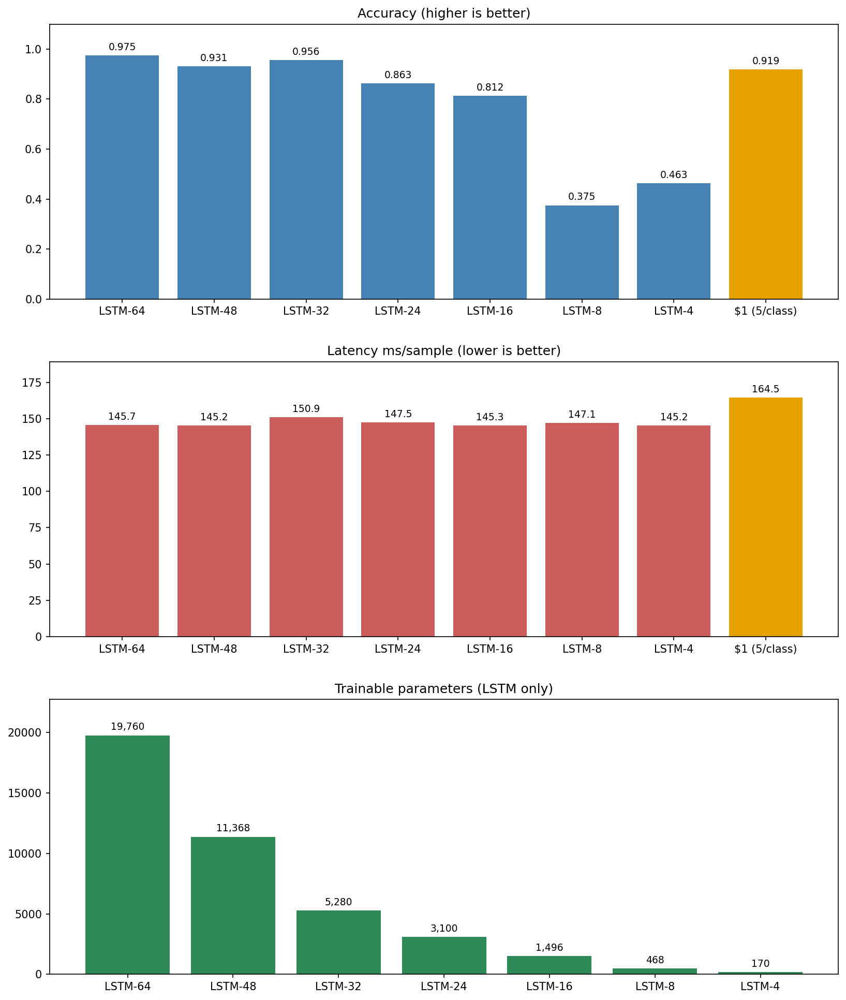
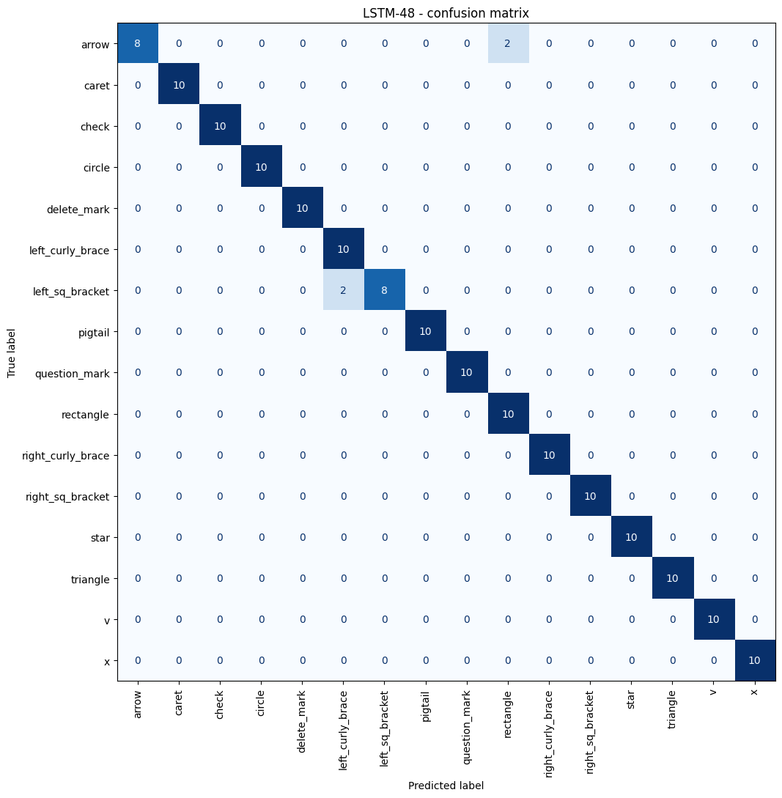
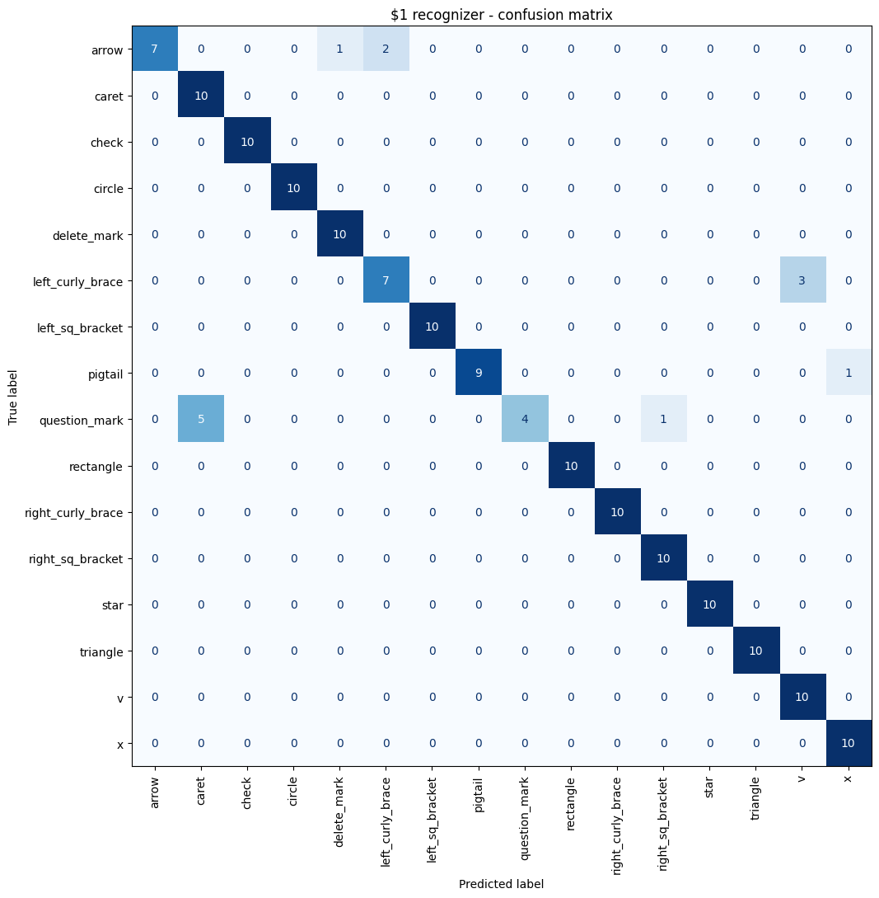

[](https://classroom.github.com/a/iuYZxbvR)


# Assignment 6: Gesture Recognition

## Setup
1. Clone the repo and navigate to it via `cd assignment-06-gesture-recognition-Alphazerfall`.
2. Set up a virtual environment by running `python -m venv .venv`.
3. Activate the virtual environment using `.venv\Scripts\activate` on Windows and `source .venv/bin/activate` on Linux/Mac.
4. Install the required dependencies via `pip install -r requirements.txt`.
5. Download the [Unistroke gesture logs](https://depts.washington.edu/acelab/proj/dollar/xml.zip) from Wobbrock et al., rename the extracted folder to `wobbrock` and place it into `datasets/`.

## 1. Implementing the $1 Gesture Recognizer

The recognizer is implemented from scratch in [`recognizer.py`](recognizer.py), following the pseudocode from [Wobbrock's website](https://depts.washington.edu/acelab/proj/dollar/index.html). It distinguishes five gestures: **rectangle**, **circle**, **check**, **delete** and **pigtail**.

It is trained with **five templates per class**, taken from the Wobbrock logs (one medium-speed sample from each of five different writers). Using several writers instead of my own recordings makes it generalize to whoever draws into it, not just my hand. More templates per class also make the matching robust to drawing direction and start point, which a single ideal shape would not be.

### Input UI

[`gesture_input.py`](gesture_input.py) is a small pyglet window where you draw a gesture with the mouse. On release the stroke is recognized and the result (name, score, time in ms) is shown above the canvas.

```bash
python gesture_input.py
```

| Key / Action | Result |
|--------------|--------|
| Hold left mouse + drag | Draw a stroke in the canvas |
| Release mouse | Recognize the stroke |
| `R` | Clear the canvas |
| `Q` | Quit |

## 2. Comparing Gesture Recognizers

The comparison is reported in [`unistroke_gestures.ipynb`](unistroke_gestures.ipynb). The LSTM is trained on the Wobbrock logs in `datasets/wobbrock/`, the test set is the gestures I recorded myself (`datasets/custom/`).

The notebook loads and resamples each stroke to a fixed length, and trains several versions with decreasing parameter counts (from `LSTM-64` down to `LSTM-4`) and runs the $1 recognizer with 5 random templates per class on the same test set. Accuracy and per-sample prediction time of all versions are compared, with confusion matrices and a short discussion of which to pick for a real application.

### Results

| Method | Params | Accuracy | Latency (ms) |
|--------|-------:|---------:|-------------:|
| LSTM-64 | 19,760 | 0.975 | 145.7 |
| LSTM-48 | 11,368 | 0.931 | 145.2 |
| LSTM-32 | 5,280 | 0.956 | 150.9 |
| LSTM-24 | 3,100 | 0.863 | 147.5 |
| LSTM-16 | 1,496 | 0.812 | 145.3 |
| LSTM-8 | 468 | 0.375 | 147.1 |
| LSTM-4 | 170 | 0.463 | 145.2 |
| $1 (5/class) | – | 0.919 | 164.5 |

Accuracy, latency and parameter count across the LSTM sizes and the $1 recognizer:



Confusion matrices on the recorded test set, for the best LSTM and the $1 recognizer:





### Recording a test set

[`gesture_recorder.py`](gesture_recorder.py) is a pyglet tool for capturing my own gestures. It cycles through all 16 Wobbrock classes and asks for ten samples of each. Every stroke is saved as an XML file in the same format as the Wobbrock logs (`datasets/custom/s1/<class><NN>.xml`, e.g. `circle03.xml`), so the notebook loads them with the same code. It remembers how many samples are already saved per class, so you can stop and continue later.

Each shape was drawn using the gesture images on [Wobbrock's $1 page](https://depts.washington.edu/acelab/proj/dollar/index.html) as a reference, so the recorded strokes match the expected form and direction of each class.

```bash
python gesture_recorder.py
```

| Key / Action | Result |
|--------------|--------|
| Hold left mouse + drag | Draw the gesture shown at the top |
| `ENTER` / `Space` | Save the stroke and continue |
| `R` / `Backspace` | Discard and redraw |
| `]` / `[` | Next / previous class |
| `Q` | Quit |

## 3. Gesture Detection Game

[`gesture_application.py`](gesture_application.py) is a drawn **Rock-Paper-Scissors** duel: draw your move, the computer picks one, first to three wins. The move (**circle = rock**, **rectangle = paper**, **V = scissors**) is recognized with the **$1 recognizer** from task 1, using 5 templates per class. For three shapes this different $1 is accurate enough and needs no model file, so the game runs straight away. A 3-class LSTM on the same gestures is trained at the end of [`unistroke_gestures.ipynb`](unistroke_gestures.ipynb), only for comparison.

```bash
python gesture_application.py
```

| Key / Action | Result |
|--------------|--------|
| Hold left mouse + drag | Draw your move in the canvas |
| Release mouse | Play the move |
| `Space` | Next round / play again |
| `Q` | Quit |

